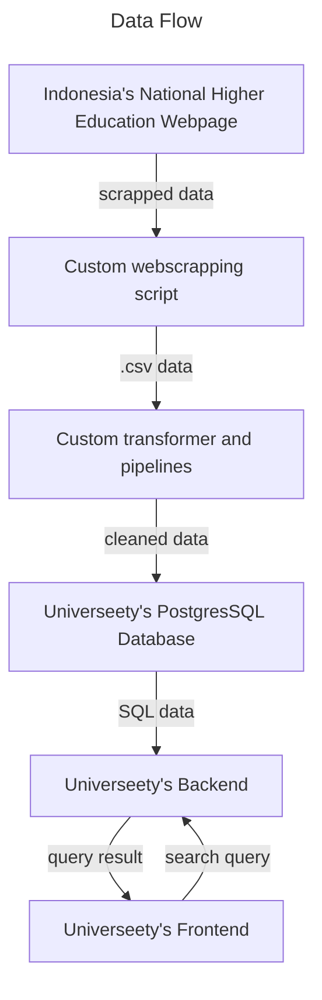

# Universeety

A map based website to explore data from [Indonesia's National Higher Education Database](https://pddikti.kemdikbud.go.id/).

## The Idea

When I explored the data in [Indonesia's National Higher Education Database](https://pddikti.kemdikbud.go.id/), I though to myself

> Hmm, wouldn't it be more interesting if I can see the university data on a map instead of a boring list?

Then here it is, the realization of that idea is [universeety.fun](https://www.universeety.fun)

## The Process

### 1. Data mining

The data was mined using custom `python` and `selenium` script. The data is then transformed to fill in missing location (latitude, longitude) data using `Google Maps API`

### 2. Setting up the database and backend

The data is then stored to a `PostgresSQL` database and then served through a backend API built using `Django` and `Django Rest Framework`

### 3. Setting up the frontend

The frontend is built using `ReactJS` and `Google Map API`. The frontend's job is to send the user query to the backend API and serve the data on a map.

## The Result

The landing page of [universeety.fun](https://www.universeety.fun), here you can enter a search query to begin exploring higher education institution in Indonesia.

After entering the query, the map will show pins on the map denoting places that matches with the query.

By clicking the floating button on the bottom left of the map view, the map can also be turned into a heatmap to show the density of mathces in each provinces in Indonesia.

A list view is also provided as an alternative to people who want to see it.
